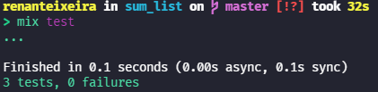
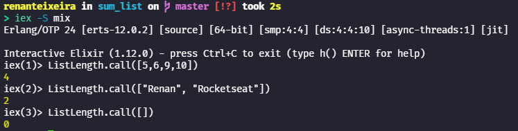

# Desafio 01 - ListLength - Contagem de Itens

&nbsp;

## ✨ Descrição

&nbsp;

Primeiro desafio da Trilha [Elixir](https://elixir-lang.org/) do curso [💜Rocketseat - Ignite](https://rocketseat.com.br/ignite)

&nbsp;&nbsp;

## 💻 Projeto

&nbsp;

O desafio é criar um módulo **ListLength** contendo uma função **call** que recebe como argumento uma Lista de elementos. Essa função deve retornar o tamanho dessa lista.

&nbsp;&nbsp;

**Testes:**

  

&nbsp;&nbsp;

**Execução:**

  

